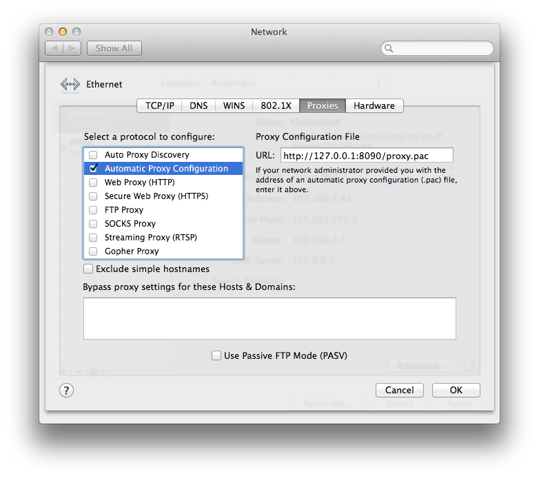

#   PAControl

Just master your proxies.

##  Functions
1.  Switch within Global Proxies, supporting HTTP, SOCKS, etc.
2.  Switch between your PAC files, including local configurations.
3.  Auto bypass LAN and commonly domestic website addresses in China.
4.  More is comming soon.

##  Developing Process
- [x] PAC
- [x] Global
- [x] Bypass
- [x] Multiple Options
- [ ] JSON extension
- [ ] Customize JSON databases

##  Usage
```
>sp -h
usage: sp: [-h|--help] [-b on|off] [-g <proxy>] [-p PACtype]

optional arguments:
	-h, --help		show this help
	-g <proxy>		to Global Mode, including "-b on", e.g.,
		-g ss			Shadowsocks with Bypass (default)
		-g gae -b off		GoAgent without Bypass (manually)
	-p <pac>		to PAC Mode, including "-b off", e.g.,
		-p b|black		Blacklist without Bapass (default)
		-p w|white -b on	Whitelist with Bypass (manually)
	-b <on|off>		to switch Bypass
		-b on			Enable Bypass
		-b off 			Disable Bypass
```

##  Examples
1.	to ss

	```
	>sp -g ss
	Password:
	Network has been set to Global Mode.
	```
	
2.	to gae without bypass

	```
	>sp -g gae -b off
	Network has been set to Global Mode.
	```
	
3. to whitelist

	```
	sp -p b
	Network has been set to Blacklist PAC.
	```
	
4. to blacklist with bypass

	```
	sp -p white -b on
	Network has been set to Whitelist PAC.
	```
	
